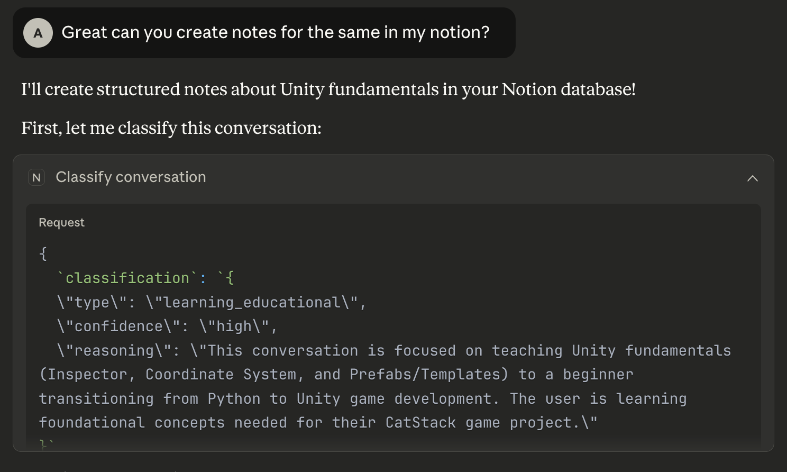
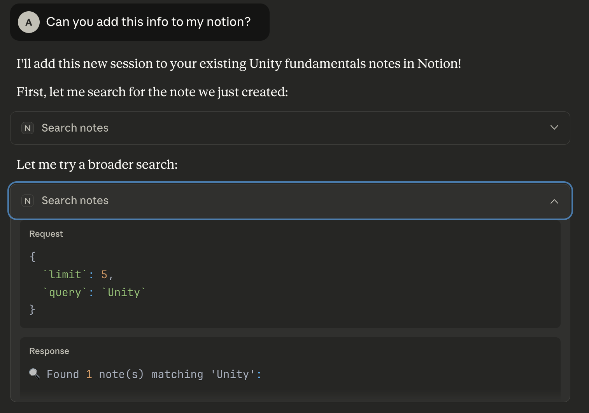
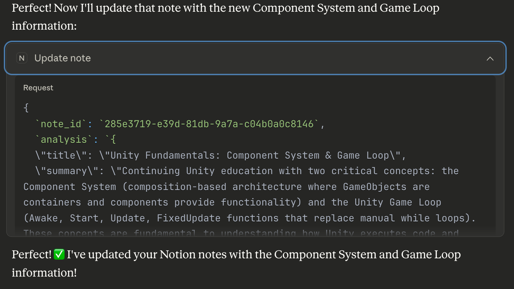

# 🧠 Notion Knowledge Distiller

> Transform your conversations into structured, searchable knowledge in Notion

An intelligent Model Context Protocol (MCP) server that automatically distills chat conversations into organized Notion database entries with adaptive formatting, smart deduplication, and full CRUD operations.

**Key Stats**: 6 MCP Tools • 4 Conversation Types • Complete CRUD • Smart Recommendations

---

## ✨ Features

### 🎯 Intelligent Classification
- **Automatic conversation type detection** with confidence scoring
- Four adaptive structures:
  - **Project/Problem Solving**: Insights, Decisions, Action Items
  - **Idea Brainstorming**: Core Ideas, Interesting Points, Follow-up Questions
  - **Learning/Educational**: Key Concepts, Examples, Takeaways
  - **General Discussion**: Main Points

### 🔍 Complete Knowledge Base Operations
- **Create** structured notes with type-specific formatting
- **Search** by keywords, topics, or conversation type
- **Read** full content with markdown-style formatting
- **Update** existing notes with dated session appending

### 🧠 Smart Workflow
- **Similarity detection** automatically finds related notes
- **Intelligent recommendations** based on topic overlap, title similarity, and recency
- **User choice** with transparent scoring (update existing vs create new)
- **Topic merging** across sessions prevents duplication

### 📊 Database-Powered Organization
- **Structured properties**: Type, Date, Topics, Status, Confidence
- **Queryable history**: Filter, sort, and find notes easily
- **Temporal narrative**: Dated updates preserve complete project history
- **No manual organization**: Automatic tagging and categorization

---

## 🎬 Demo

### Classification in Action

*Claude automatically classifies conversations into one of four types with confidence scoring*

### Intelligent Search

*Search through your knowledge base by keywords, topics, or conversation type*

### Smart Update Detection

*System finds similar notes and recommends whether to update existing or create new*

---

## 🚀 Installation & Setup

### Prerequisites
- Python 3.10 or higher
- [uv](https://github.com/astral-sh/uv) package manager (recommended)
- Claude Desktop app
- Notion account with integration access

### 1. Clone & Install

```bash
# Clone the repository
git clone git@github.com:akshayb7/notion-knowledge-distiller-mcp.git
cd notion-knowledge-distiller

# Install uv if you haven't already
curl -LsSf https://astral.sh/uv/install.sh | sh

# Create virtual environment and install dependencies
uv .venv
source .venv/bin/activate  # On Windows: .venv\Scripts\activate
uv pip install -e .

# For development dependencies (optional)
uv pip install -e ".[dev]"
```

### 2. Set Up Notion Integration

1. Go to [notion.so/my-integrations](https://www.notion.so/my-integrations)
2. Click **"+ New integration"**
3. Name it (e.g., "Claude Knowledge Distiller")
4. Copy the **Internal Integration Token**

### 3. Create Notion Database

1. In Notion, create a new **Database** (inline or full page)
2. Name it **"Conversation Notes"**
3. Add these properties:

| Property | Type | Options |
|----------|------|---------|
| Title | Title | (default) |
| Type | Select | Project Problem Solving, Idea Brainstorming, Learning Educational, General Discussion |
| Date | Date | - |
| Topics | Multi-select | (auto-populated) |
| Status | Select | New, In Progress, Complete, Archived |
| Confidence | Select | High, Medium, Low |

4. **Share the database** with your integration:
   - Click "..." → "Add connections" → Select your integration

5. **Copy the database ID** from the URL:
   ```
   https://notion.so/workspace/DATABASE_ID?v=...
                              ^^^^^^^^^^^
   ```

### 4. Configure Environment

```bash
# Copy example env file
cp .env.example .env

# Edit .env and add your credentials
NOTION_API_KEY=secret_xxxxxxxxxxxxxxxxxxxxxxxxxxxxxxxxxxxxx
NOTION_PARENT_PAGE_ID=your_parent_page_id_where_database_is_created
NOTION_DATABASE_ID=your_database_id_here
```

### 5. Configure Claude Desktop

Add to your Claude Desktop config:

**macOS**: `~/Library/Application Support/Claude/claude_desktop_config.json`  
**Windows**: `%APPDATA%\Claude\claude_desktop_config.json`

```json
{
  "mcpServers": {
    "notion-distiller": {
      "command": "/FULL/PATH/TO/.venv/bin/python",
      "args": [
        "/FULL/PATH/TO/notion-knowledge-distiller/run_server.py"
      ]
    }
  }
}
```

**Important**: Use absolute paths, not relative paths!

### 6. Test Installation

1. Restart Claude Desktop completely
2. In Claude, ask:
   ```
   Use the ping tool to test the notion-distiller server
   ```
3. You should see: ✅ MCP Server is running!

---

## 💡 Usage

### Basic Workflow: Create Notes

```
You: "Create notes for this conversation in Notion"

Claude:
1. Classifies conversation type
2. Extracts structured content
3. Searches for similar existing notes
4. IF similar notes found:
   - Shows similarity score
   - Recommends update or create
   - Asks for your choice
5. Creates/updates Notion entry
```

### Searching Your Knowledge Base

```
You: "Find my Unity development notes"
```

Claude searches by keywords and shows matching notes with metadata.

```
You: "Show me all my brainstorming sessions"
```

Filter by conversation type to find specific categories.

### Reading Past Notes

```
You: "Read my MCP server notes"
```

Claude searches, finds the note, and displays formatted content.

### Updating Existing Notes

```
You: "Add today's progress to my Unity notes"
```

Claude finds the note, appends new session with date header, preserves all old content.

### Smart Workflow Example

```
You: "Create notes about my React learning"

Claude: 
🔍 Found similar note: "React Hooks Deep Dive"
   - Last updated: 3 days ago
   - Topics: React, JavaScript, Hooks
   - Similarity Score: 72/100

💡 Recommendation: UPDATE (high confidence)
Same topic with recent activity suggests continuation.

Would you like to:
A) Update existing note (recommended)
B) Create new note

You: "A"

Claude: ✅ Updated with new session!
```

---

## 📚 Conversation Types

The system adapts note structure based on conversation type:

### 🔧 Project Problem Solving
**Use for**: Technical implementation, debugging, building projects

**Structure**:
- 📝 Summary
- 🏷️ Topics
- 💡 Key Insights
- ✅ Decisions Made
- 📋 Action Items (as checkboxes)

### 💭 Idea Brainstorming
**Use for**: Creative discussions, exploring concepts, what-if scenarios

**Structure**:
- 📝 Summary
- 🏷️ Topics
- 💭 Core Ideas
- ✨ Interesting Points
- 🤔 Follow-up Questions

### 📚 Learning Educational
**Use for**: Learning new concepts, tutorials, deep dives

**Structure**:
- 📝 Summary
- 🏷️ Topics
- 📚 Key Concepts
- 💡 Examples
- 🎯 Key Takeaways

### 💬 General Discussion
**Use for**: Q&A, casual chat, mixed topics

**Structure**:
- 📝 Summary
- 🏷️ Topics
- 📌 Main Points

---

## ⚙️ Configuration

### Environment Variables

```bash
# Required
NOTION_API_KEY=secret_xxx...           # Notion integration token
NOTION_DATABASE_ID=xxx...              # Database to store notes in

# Optional (for backward compatibility with page mode)
NOTION_PARENT_PAGE_ID=xxx...           # Parent page for notes (deprecated)
```

### Database Properties

The system expects these properties in your Notion database:

- **Title** (Title): Conversation title
- **Type** (Select): Conversation classification
- **Date** (Date): Last update timestamp
- **Topics** (Multi-select): Auto-generated tags
- **Status** (Select): Manual workflow tracking
- **Confidence** (Select): Classification confidence

### Similarity Scoring

The smart update recommendation uses weighted scoring:

| Factor | Weight | Description |
|--------|--------|-------------|
| Topic Overlap | 60% | Common topics / total unique topics |
| Title Similarity | 30% | Common words in titles |
| Recency | 10% | <7 days = higher score |

**Score Thresholds**:
- ≥60: Update (high confidence)
- 40-59: Update (medium confidence)
- 20-39: Ask user
- <20: Create new

---

## 📂 Project Structure

```
notion-knowledge-distiller/
├── src/
│   ├── __init__.py
│   ├── server.py           # MCP server & tool handlers
│   ├── notion_client.py    # Notion API wrapper
│   └── prompts.py          # Classification & schemas
├── run_server.py           # Entry point script
├── pyproject.toml          # Dependencies
├── .env.example            # Environment template
├── .gitignore
└── README.md
```

**Key Files**:
- `server.py`: Defines 6 MCP tools and handles tool calls
- `notion_client.py`: Notion API operations (create, update, search, similarity scoring)
- `prompts.py`: Conversation type definitions and schemas
- `run_server.py`: Handles Python import paths for MCP execution

---

## ❓ FAQ

### How does classification work?
Claude analyzes the conversation content and determines the primary type based on the nature of discussion (technical work, creative thinking, learning, or general chat). Confidence levels indicate certainty.

### Can I change conversation types?
Types are set at creation but don't restrict updates. You can update any note with any type of content - the structure just guides organization.

### What if I disagree with the similarity recommendation?
You always have the final say! The system shows its reasoning and score, but you can choose to update when it recommends create, or vice versa.

### How are topics generated?
Topics are extracted from the conversation (3-5 relevant keywords). When updating notes, old and new topics are merged without duplicates.

### Can I use this with GitHub Copilot or other MCP clients?
Yes! Any MCP-compatible client can use this server. Configuration steps may vary by client.

### What happens to old content when updating?
All old content is preserved. Updates append a new dated section (e.g., "Update - October 07, 2025") below the existing content.

### How do I delete notes?
Delete directly in Notion. The MCP server doesn't provide deletion to prevent accidental data loss.

### Why use a database instead of regular pages?
Databases enable powerful querying, filtering, and organization. You can search by type, filter by date, track status, and build views - impossible with plain pages.

### Can I have multiple databases?
Currently, one database per configuration. You could run multiple server instances with different configs for separate knowledge bases.

### Does this work with Notion's AI features?
Yes! Notion AI can summarize, extract info, or answer questions about your knowledge base once it's in Notion.

---

## 📄 License

MIT License - feel free to use, modify, and distribute.

---

## 🎉 Acknowledgments

Built with:
- [FastMCP](https://github.com/jlowin/fastmcp) - MCP server framework
- [Notion API](https://developers.notion.com/) - Knowledge storage
- [Claude](https://claude.ai) - AI-powered conversation analysis

---

**Happy knowledge building!** 📚✨

For issues or questions, please open a GitHub issue.